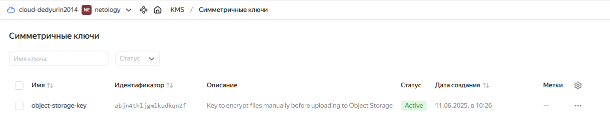
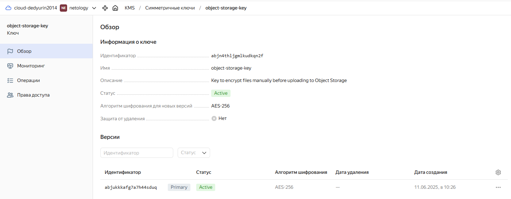
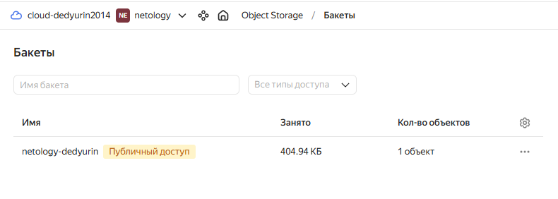
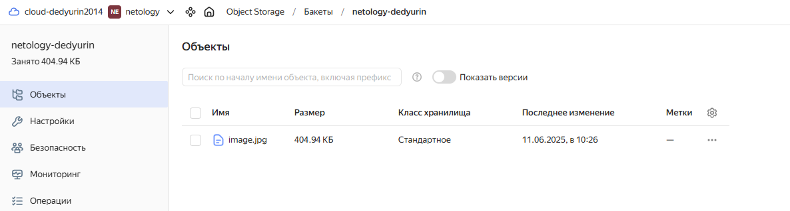
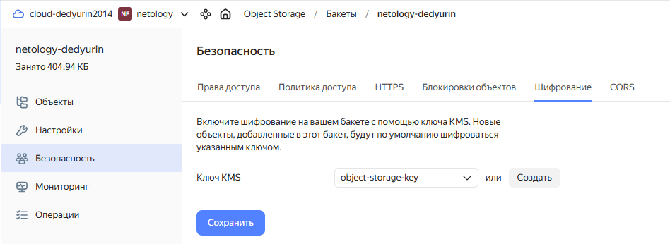
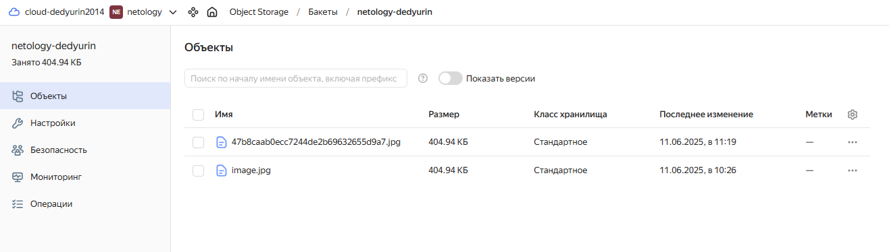
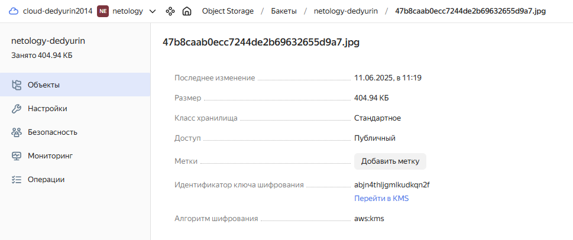
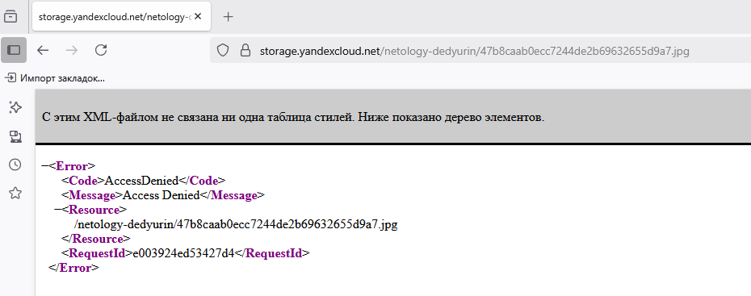

# Домашнее задание к занятию «`Безопасность в облачных провайдерах`» - `Дедюрин Денис`

---
## Задание 1. Yandex Cloud   

1. С помощью ключа в KMS необходимо зашифровать содержимое бакета:

 - создать ключ в KMS;
 - с помощью ключа зашифровать содержимое бакета, созданного ранее.
2. (Выполняется не в Terraform)* Создать статический сайт в Object Storage c собственным публичным адресом и сделать доступным по HTTPS:

 - создать сертификат;
 - создать статическую страницу в Object Storage и применить сертификат HTTPS;
 - в качестве результата предоставить скриншот на страницу с сертификатом в заголовке (замочек).

### Ответ:

Все исходники лежат в папке **src** текущего репозитория.

1. Создаем ключ в KMS, а также бакет с загруженной картинкой.

 KMS

 Симметричный ключ

 Бакет

 Содержимое бакета

Через UI включаем шифровние на бакете, т.к. через terraform на текущий момент это сделать невозможно.

 Включение шифрования

Т.к. картинка была добавлена одновременно с бакетом, зашифровать ее не получится. И чтобы зашифровать, нужно вручную добавить новый объект в бакет.

 Новый объект

 Зашифрованный объект

Пробуем перейти по полученной ссылке на зашифрованной объект

 Ссылка в браузере